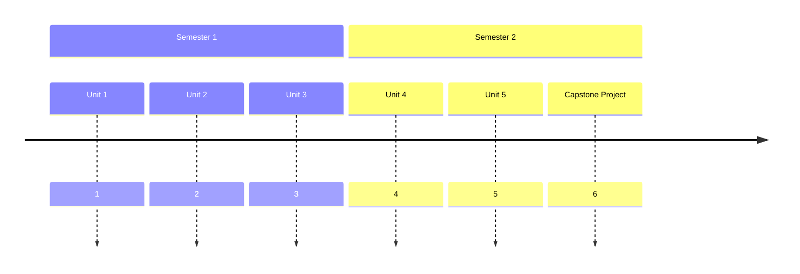

## Course Overview  
This course provides a comprehensive introduction to the *principles*, *methods*, and *practices* of **empirical research in social sciences**, with a strong focus on developing the *skills* required to conceptualize, design, execute, and communicate rigorous research. This *transdisciplinary* course takes a *learner-centric* and *inquiry-based* approach. Learners have the *autonomy* to explore social topics of their interests and apply research skills, among many others, in their investigations. Furthermore, learners are encouraged to explore topics relevant and significant to their *local contexts* so that their investigations and findings may bring *positive impacts* to local communities.

## Learner Profile  
Through this course, learners will become
- **ethical researchers**, who demonstrate curiosity in exploring the unknown with well-framed research questions, the ability to identify, summarize, and synthesize knowledge from existing literature, the ability to choose and implement appropriate research designs and methodology, and awareness of and adherence to ethical principles and guidelines in every stage of research.
- **critical and creative thinkers**, who can make informed choices through critical analysis and evaluation of strengths and limitations, demonstrate awareness of biases, assumptions, and tradeoffs when making those choices, construct creative solutions to problems and challenges, and demonstrate meta-cognitive abilities through reflections.
- **effective communicators**, who can listen actively, deliver information effectively through appropriate mediums of communication, and provide constructive feedback to others.
- **respectful collaborators**, who can work in a team towards a common goal by actively contributing to tasks and discussions, empathizing with the group and motivating others to succeed, and being open to and respecting differences.
- **disciplined project and self-managers**, who set project and personal goals and develop strategies to achieve them, anticipate challenges and obstacles and take actions, meet deadlines, and demonstrate resilience and positive thinking when facing adversaries and setbacks.
- **digital citizens**, who are proficient in using online libraries and databases for sources and secondary data, in using research management tools to track sources, organize information, and take notes, in using creative tools to convey information digitally, and in using statistical and programming software for data analysis and visualization.

## Conceptual Understandings  
Along with skill acquisition and development, learners will also cultivate key conceptual understanding such as
- **cause** and **consequence** as the core inquiry in empirical research, between dependent and independent variables, and with the presence of confounding variables.
- **change** as a necessary condition for the identification of causal effects and as a needed response in research design and methodology when facing changes in data availability
- **bias** as a source of error introduced in different stages of research

## Assessment Model
This course's assessments emphasize the learners' development and progress towards the learner profile. Specifically, the assessments use a standards-based approach with six criteria from the learner profile and four mastery levels for each. A complete assessment rubric can be found here.

## Timeline

This is a test

$ \sqrt{m} = n\in\mathcal{N} $
